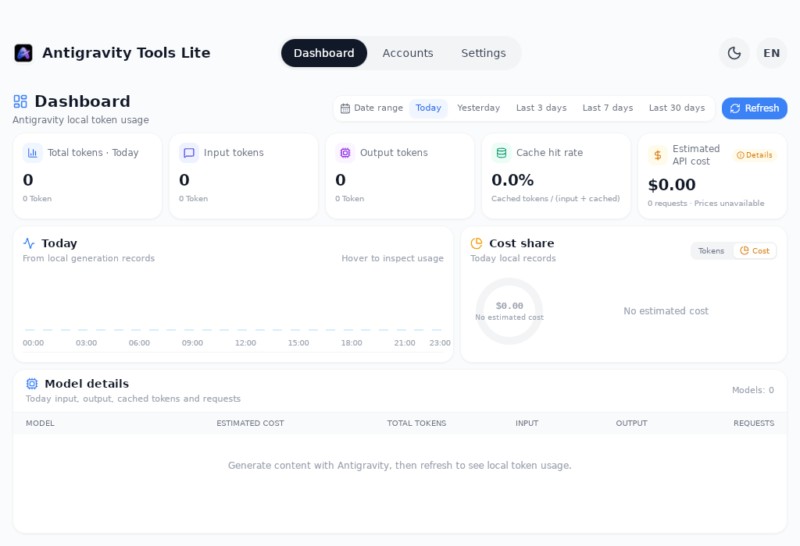
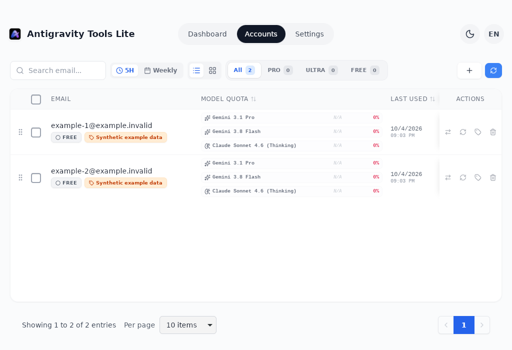
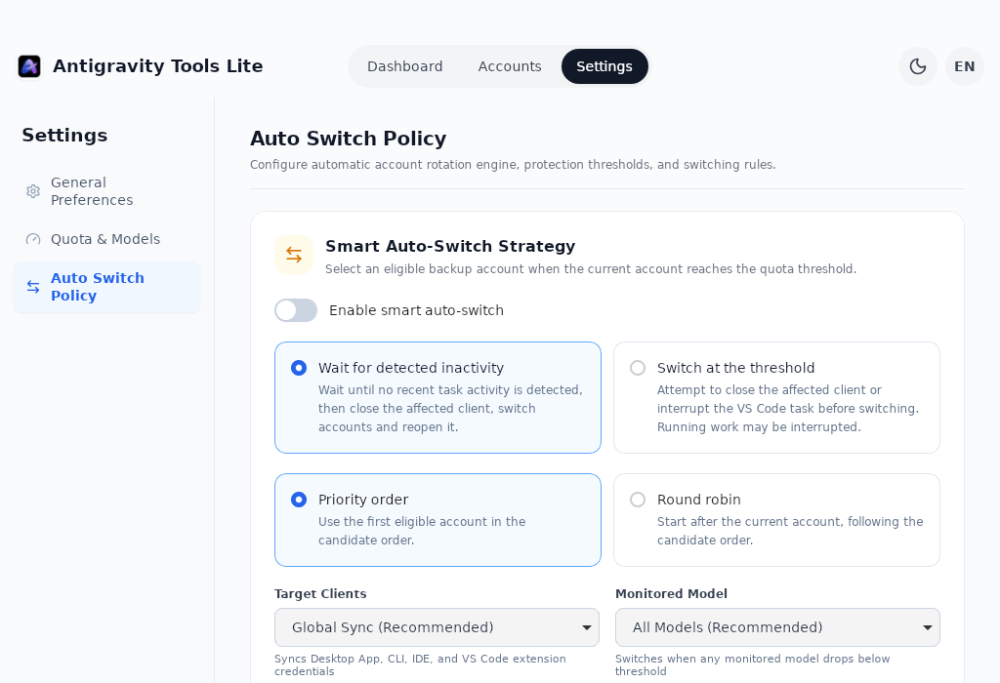
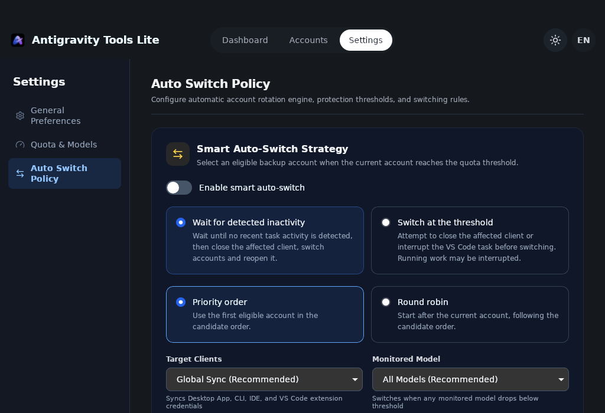

# Antigravity Tools Lite

[简体中文](./README.zh-CN.md)

A local desktop application for [Antigravity](https://antigravity.google). It manages the Google accounts used by the Antigravity app and its `agy` CLI, shows per-model quota with reset countdowns, and summarises locally recorded token usage together with an estimated API cost. Account and usage records are stored locally, and usage aggregation runs on the device. Google authorization, token refresh and quota queries use the network and the corresponding credentials; price synchronization also uses the network



Native Linux Tauri/WebKitGTK viewport, CI debug build `5be961d3`, English UI and synthetic example data; system window frame excluded. [Screenshot sources and platform limits](docs/screenshots/4.7.9/README.md)

## Overview

- **Account management** — import accounts already present on the machine, switch the account Antigravity uses, annotate accounts with remarks, remove them again
- **Quota overview** — per-model quota and reset time, grouped by PRO / ULTRA / FREE, with table and card views
- **Usage dashboard** — token usage for today, yesterday, the last 3, 7 or 30 days, broken down per model, with an estimated API cost
- **Quick dashboard** — inspect quotas from the menu bar or tray, with a separate action to activate an account
- **Smart switching** — optional backup-account selection by priority or round robin, with activity checks and configurable thresholds; running tasks are not migrated
- **One switch for both clients** — switching synchronizes the credentials used by Antigravity and an initialized `agy` CLI
- **Local storage** — no project-operated proxy or credential relay service; local account and usage storage with direct Google authorization and quota requests
- **Bilingual interface** — Simplified Chinese and English, light and dark themes, tray menu

## Download

**[Latest release](https://github.com/anglee0323/antigravity-tools-lite/releases/latest)**

| Platform | Package | Installation |
| --- | --- | --- |
| macOS (Apple Silicon) | `Antigravity-Tools-Lite-<version>-macos-arm64.zip` | Unpack, then move `Antigravity Tools Lite.app` to Applications |
| Windows (x64) | `Antigravity-Tools-Lite-<version>-windows-x64-setup.exe` | NSIS installer, per-user installation |
| Linux (x64) | `Antigravity-Tools-Lite-<version>-linux-amd64.deb` | `sudo apt install ./package.deb` |

The release workflow does not configure Developer ID signing/notarization or Windows Authenticode signing. macOS or Windows may therefore warn about or block a downloaded package. Check its release source and checksum, and make any required trust decision yourself through the operating system's normal review flow. See [Apple's guidance](https://support.apple.com/en-gb/102445) and [Microsoft's app-reputation guidance](https://learn.microsoft.com/en-us/windows/apps/package-and-deploy/smartscreen-reputation). Homebrew does not remove these platform checks

**macOS distribution:** Complete ad-hoc signing fixes bundle integrity, but does not establish Apple trust. Actual Homebrew installation of v4.7.8 succeeded on Apple Silicon; Gatekeeper rejected that public app. Developer ID signing and notarization are still required for normal trusted distribution.

## Account management

The **+** button offers three ways to add an account

- **OAuth** — opens the browser, the account is added after you approve access with Google
- **Refresh token** — paste a single token or a JSON array of tokens to import several accounts at once
- **Import from this machine** — scans the system credential store, the Antigravity databases, installed plugins, the native agy session and the legacy CLI data directory (`~/.antigravity-agent`), then imports every account it finds



Each row provides four actions, each with a tooltip

| Action | Effect |
| --- | --- |
| **Switch to this account** | Writes the selected account to Antigravity's credential store (or `state.vscdb` on builds older than 2.0) and synchronizes an initialized native agy session. A manual switch may close and restart Antigravity; save work first. Reopen the client and verify its account. If a partial update is reported, inspect both clients before retrying |
| **Refresh quota** | Re-reads this account's per-model quota and reset times |
| **Edit remark** | Stores a short label, up to 15 characters, to distinguish accounts |
| **Delete** | Removes the account from this application |

Rows can be sorted by quota reset time or by last use, reordered by dragging, and displayed as a table or as cards. Selecting several rows enables batch refresh and batch delete; the filter row narrows the list to All, PRO, ULTRA or FREE

### Why the application is closed during a switch

A single switch synchronizes the credential locations used by Antigravity and an initialized `agy` CLI. The application is closed during the switch because a running instance keeps the previous token in memory and writes it back when it refreshes, which would silently revert the switch. Start a new CLI command after switching; an already-running CLI command may retain its previous token

On Antigravity builds older than 2.0 there is no credential entry to write; the application detects this and injects the token into the local `state.vscdb` database instead, while still synchronizing an initialized native agy session. Separate IDE-targeted switches keep their own database-only behavior

Native agy sessions use `~/.gemini/antigravity-cli/antigravity-oauth-token` on all three platforms. Only an existing `antigravity-cli` directory is used; normal APP synchronization can create its first token file if needed. The APP and agy may share a system credential store, so a file-only update does not establish which account a new agy process will use. Use normal APP synchronization and verify the active identity in the client. Generic Google Gemini CLI files (`~/.gemini/oauth_creds.json` and `~/.gemini/google_accounts.json`) are neither created, changed nor deleted

Session updates use atomic replacement and readback verification, with `0600` permissions on Unix. Modern, keyring-backed Linux APP switches restore the previous keyring credentials if session synchronization fails. A legacy APP database update is not rolled back and is reported as a partial update on session failure. On macOS/Windows, a session failure after the keyring update is reported as a partial update; check both clients before retrying

## Usage dashboard

The dashboard reads Antigravity's local conversation databases (`conversation.db`, `token_usage_archive.db`) and its archive directory, then aggregates the recorded usage on the device. Tools Lite does not upload conversation content or estimate unrecorded requests

- **Date range** — today, yesterday, the last 3, 7 or 30 days; single-day ranges include an hourly chart
- **Chart details** — pointing at a bar shows that hour's input, output and cached tokens, request count and estimated cost
- **Summary cards** — total tokens, input tokens, output tokens, cache hit rate and estimated API cost
- **Model usage and model details** — per-model token and estimated-cost breakdown, with a token/cost distribution chart

Cost is estimated from Google's public Gemini pricing pages, which are fetched once a day and cached, with a built-in fallback table. Models without a known price are reported as unpriced instead of being counted as free

## Quick dashboard

On macOS, the native menu has three sections: today's local usage and estimated cost, aggregate remaining quota, and per-account quotas with explicit switch controls. Settings selects Gemini, Claude/GPT or both families, account labels, unavailable-account visibility and reset countdowns on hover, always or hidden. Aggregate percentages are equal-weight means, not summed tokens. The native menu opens from cached local data and updates in the background.

Switching may close and restart Antigravity; save work first. Current identity is checked against the running standalone Mac app when available; the full application's selection and CLI `current` remain local records. Device-wide usage is not attributed to an account.

Windows/Linux retain the shared WebView panel. Linux opens it from **Quick Dashboard** in the tray menu; the main window remains available without a tray. Native Mac login startup and multiple displays, and Windows GUI acceptance still require separate checks. See [panel behavior and platform limits](docs/menu-bar-dashboard.md).

## Settings



<details>
<summary>Dark theme — Linux native viewport</summary>



</details>

These are native Linux viewports with synthetic data; Settings content below the captured area requires scrolling.

- **Appearance and language** — follow the system, or choose light or dark; Simplified Chinese or English
- **Background tasks** — how often account quotas refresh, and how often the active account is re-read from local Antigravity data
- **Local data** — location of the application data (`~/.antigravity_tools/`), with a button to open the folder
- **Startup and menu bar** — launch at login, background launch at login and hiding the Dock icon are all off by default; hiding the Dock icon is macOS-only
- **Updates** — optional startup checks and a manual check in Settings; a new-version notice opens this repository’s official release page. Installer download and automatic installation are not implemented

## Data handling

| | |
| --- | --- |
| Read | Antigravity's local conversation databases and archives, which contain token counts, model names and timestamps |
| Written | `~/.antigravity_tools/` for accounts, configuration and cached pricing, the operating system credential store, and the initialized native agy session when an account is switched |
| Network | Google authorization, token refresh and quota queries use the required credentials; price synchronization also needs network access |
| Service boundary | Tools Lite provides no credential relay service and does not upload conversation content |

## Building from source

See [Linux support](docs/linux.md) for Linux build and compatibility details.

Node.js 22 or newer, a stable Rust toolchain and the platform build tools required by Tauri 2 are needed

```bash
npm ci
npm run tauri dev       # development
npm run build           # frontend only
npm run tauri build     # macOS .app or Windows installer
```

Bundles are written to `src-tauri/target/release/bundle/`. Pushing a `v*` tag runs the release workflow, which builds macOS, Windows and Linux deb packages and attaches the results to the GitHub release

## Smart account switching

This default-off feature monitors real quotas and selects only allowed backup accounts. Settings supports priority order or round robin, with drag or keyboard reordering. **Wait for detected inactivity** uses recent activity observations before closing an affected client; **Switch at the threshold** can interrupt running work. Activity detection does not prove that every task has finished. The coordinator rechecks identity, fresh quota and the pending request before writing credentials; running generations are not migrated. Reopen the client and verify its account before continuing. See [setup, limits and verification](docs/low-quota-switching.md).

## Relation to the upstream project

This project is a focused fork of [lbjlaq/Antigravity-Manager](https://github.com/lbjlaq/Antigravity-Manager). Upstream provides a full toolkit, including a reverse proxy, an HTTP API, a Cloudflared tunnel, IP management and a Docker image. This fork keeps the account manager and the local usage dashboard, removes the proxy and web-mode parts of the codebase, and adds its own dashboard, bilingual interface, theme support and release tooling. The two projects are independent; use upstream if a proxy is required

## License

Based on [lbjlaq/Antigravity-Manager](https://github.com/lbjlaq/Antigravity-Manager) and distributed under the same [CC BY-NC-SA 4.0](./LICENSE) license. The license and the attribution requirements of the original project apply to any use, modification or redistribution

## Command-line and Homebrew

Tools Lite includes `agy-switch` for account management, cached quotas, local statistics and explicit switching. On macOS and Linux, the terminal menu also supports account labels, enable/disable, confirmed deletion and account addition through browser authorization or masked token entry. It is separate from Google’s `agy`; `current` is a local record and `quota` does not refresh live data. See [CLI usage](docs/cli.md).

[v4.7.9](https://github.com/anglee0323/antigravity-tools-lite/releases/tag/v4.7.9) provides the single management command `agy-switch`. On Apple Silicon macOS, the cask in this repository installs the app and links its bundled command as `agy-switch`:

```sh
brew tap anglee0323/antigravity-tools-lite https://github.com/anglee0323/antigravity-tools-lite.git
brew install --cask anglee0323/antigravity-tools-lite/antigravity-tools-lite
agy-switch --version
agy-switch --help
```

The recipe pins the published ZIP's verified SHA-256. Actual Homebrew installation of v4.7.8 with a custom app directory succeeded, but Gatekeeper rejected the public app. Upgrade and uninstall acceptance are tracked separately. Keep a backup of an existing manually installed app and resolve any app-folder conflict yourself without deleting account data. Homebrew does not install Google's `agy`. See [Homebrew verification and limitations](docs/homebrew.md).
