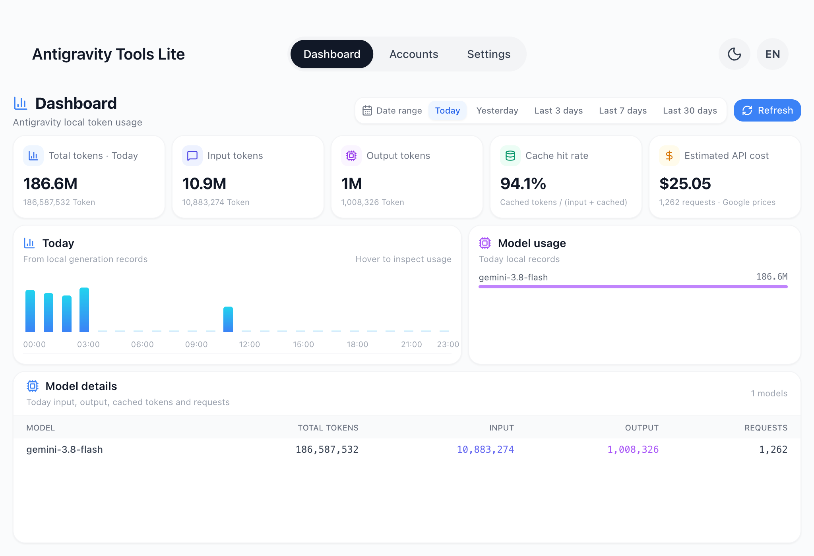
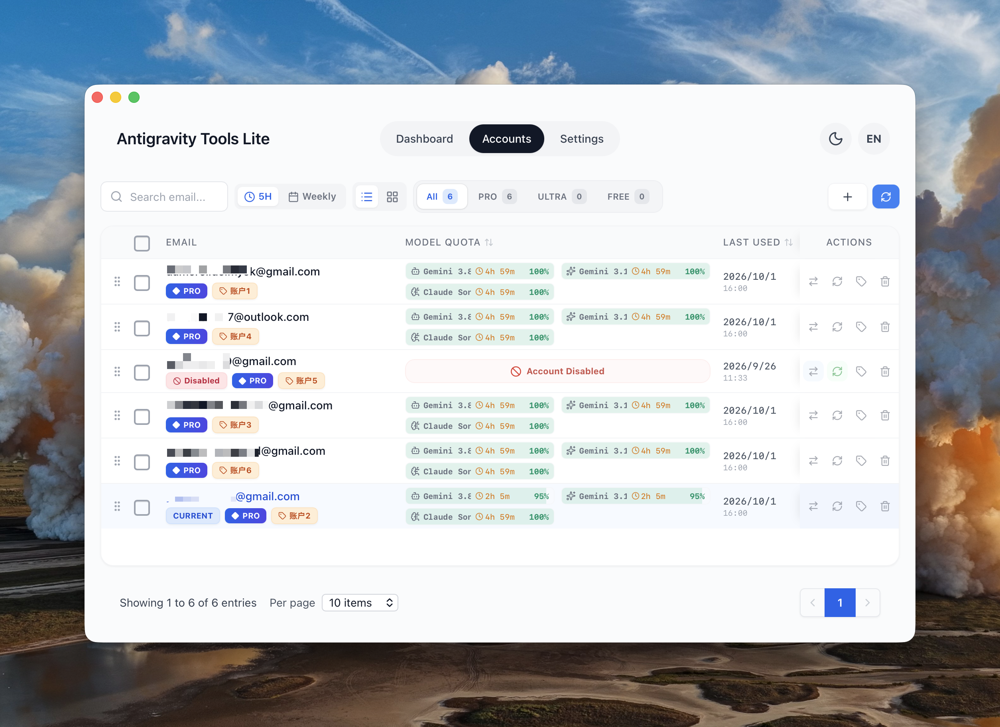
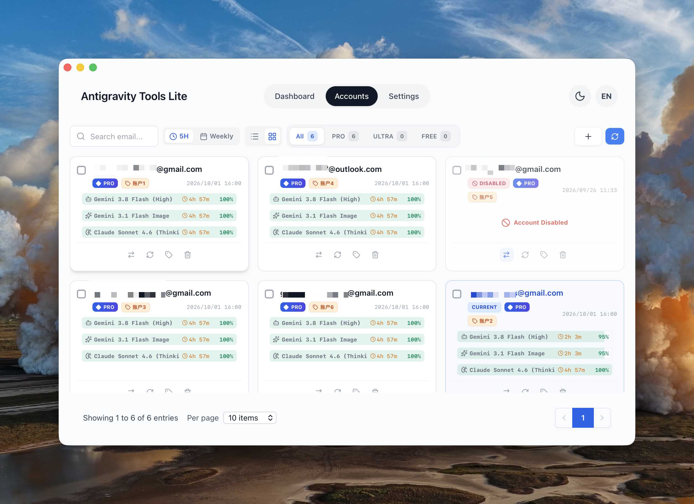
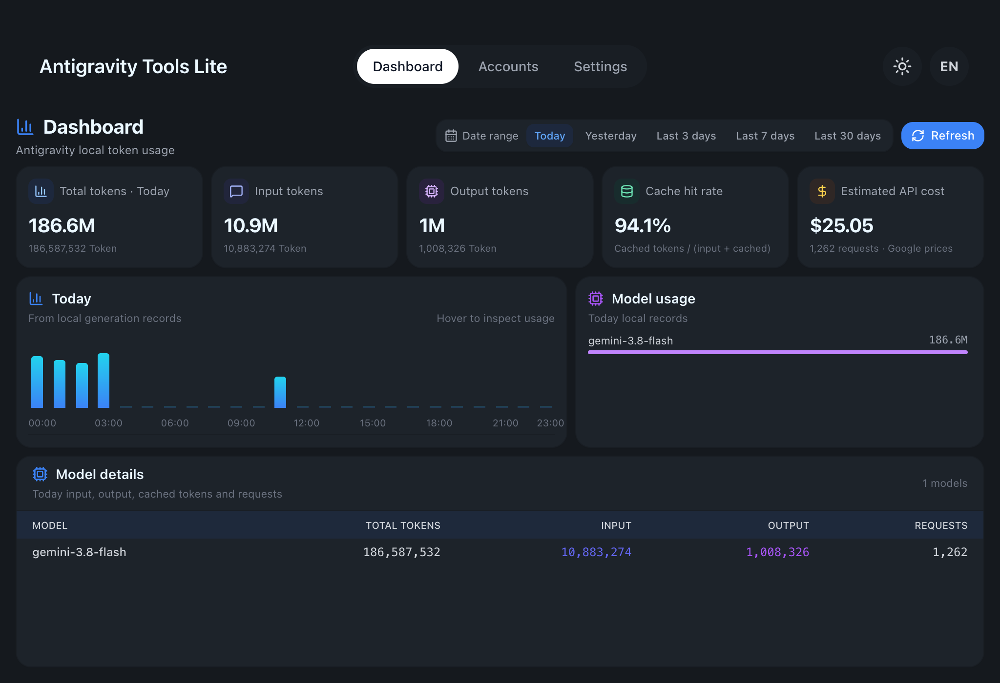
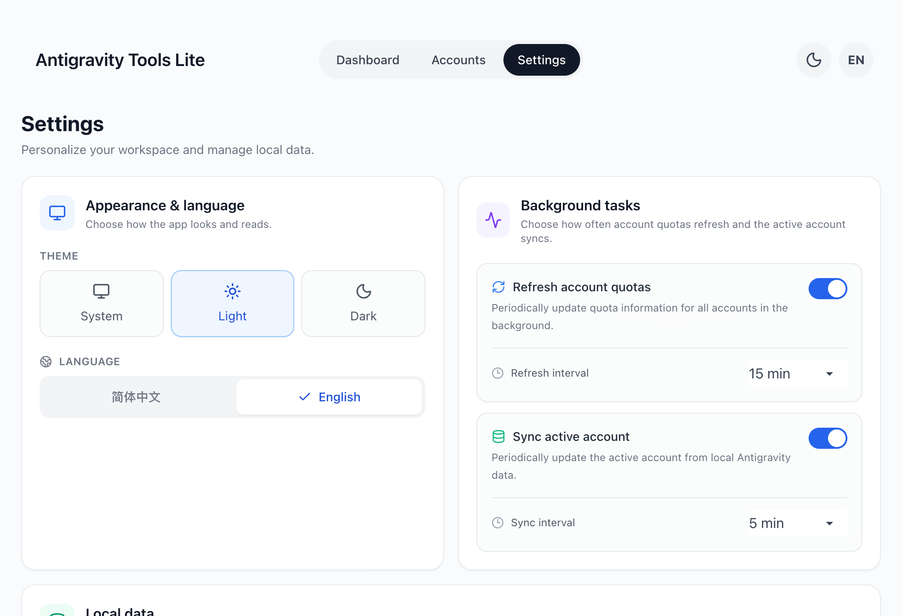

# Antigravity Tools Lite

[简体中文](./README.zh-CN.md)

A local desktop application for [Antigravity](https://antigravity.google). It manages the Google accounts used by the Antigravity app and its `agy` CLI, shows per-model quota with reset countdowns, and summarises locally recorded token usage together with an estimated API cost. All processing happens on the local machine



## Overview

- **Account management** — import accounts already present on the machine, switch the account Antigravity uses, annotate accounts with remarks, remove them again
- **Quota overview** — per-model quota and reset time, grouped by PRO / ULTRA / FREE, with table and card views
- **Usage dashboard** — token usage for today, yesterday, the last 3, 7 or 30 days, broken down per model, with an estimated API cost
- **One switch for both clients** — switching synchronizes the credentials used by Antigravity and an initialized `agy` CLI
- **Local data only** — no proxy, no background service, no telemetry; credentials stay in local account files and the credential stores required by the clients
- **Bilingual interface** — Simplified Chinese and English, light and dark themes, tray menu

## Download

**[Latest release](https://github.com/anglee0323/antigravity-tools-lite/releases/latest)**

| Platform | Package | Installation |
| --- | --- | --- |
| macOS (Apple Silicon) | `Antigravity-Tools-Lite-<version>-macos-arm64.zip` | Unpack, then move `Antigravity Tools Lite.app` to Applications |
| Windows (x64) | `Antigravity-Tools-Lite-<version>-windows-x64-setup.exe` | NSIS installer, per-user installation |
| Linux (x64) | `Antigravity-Tools-Lite-<version>-linux-amd64.deb` | `sudo apt install ./package.deb` |

macOS and Windows builds are unsigned, so the first launch triggers the usual operating system warnings

```bash
# macOS: right-click the app in Applications → Open → Open, or
xattr -dr com.apple.quarantine "/Applications/Antigravity Tools Lite.app"
```

On Windows, SmartScreen may report "Windows protected your PC" — choose **More info → Run anyway**

## Account management

The **+** button offers three ways to add an account

- **OAuth** — opens the browser, the account is added after you approve access with Google
- **Refresh token** — paste a single token or a JSON array of tokens to import several accounts at once
- **Import from this machine** — scans the system credential store, the Antigravity databases, installed plugins and the CLI data directory (`~/.antigravity-agent`), then imports every account it finds





Each row provides four actions, each with a tooltip

| Action | Effect |
| --- | --- |
| **Switch to this account** | Makes this account the one Antigravity uses. A running Antigravity is closed first, the credentials are written to the credential store Antigravity reads (or to `state.vscdb` on builds older than 2.0), and the tray is updated. After reopening Antigravity you are signed in as this account. On Linux, the initialized agy session file is synchronized separately; its next CLI command uses the selected account |
| **Refresh quota** | Re-reads this account's per-model quota and reset times |
| **Edit remark** | Stores a short label, up to 15 characters, to distinguish accounts |
| **Delete** | Removes the account from this application |

Rows can be sorted by quota reset time or by last use, reordered by dragging, and displayed as a table or as cards. Selecting several rows enables batch refresh and batch delete; the filter row narrows the list to All, PRO, ULTRA or FREE

### Why the application is closed during a switch

A single switch synchronizes the credential locations used by Antigravity and an initialized `agy` CLI. The application is closed during the switch because a running instance keeps the previous token in memory and writes it back when it refreshes, which would silently revert the switch. The CLI does not need a restart

On Antigravity builds older than 2.0 there is no credential entry to write; the application detects this and injects the token into the local `state.vscdb` database instead

## Usage dashboard

The dashboard reads Antigravity's local conversation databases (`conversation.db`, `token_usage_archive.db`) and its archive directory, then aggregates the records. No data leaves the machine and no request-level estimation is performed beyond what the records contain



- **Date range** — today, yesterday, the last 3, 7 or 30 days; single-day ranges include an hourly chart
- **Chart details** — pointing at a bar shows that hour's input, output and cached tokens, request count and estimated cost
- **Summary cards** — total tokens, input tokens, output tokens, cache hit rate and estimated API cost
- **Model usage and model details** — which models consume the quota, with a per-model breakdown table

Cost is estimated from Google's public Gemini pricing pages, which are fetched once a day and cached, with a built-in fallback table. Models without a known price are reported as unpriced instead of being counted as free

## Settings



- **Appearance and language** — follow the system, or choose light or dark; Simplified Chinese or English
- **Background tasks** — how often account quotas refresh, and how often the active account is re-read from local Antigravity data
- **Local data** — location of the application data (`~/.antigravity_tools/`), with a button to open the folder

## Data handling

| | |
| --- | --- |
| Read | Antigravity's local conversation databases and archives, which contain token counts, model names and timestamps |
| Written | `~/.antigravity_tools/` for accounts, configuration and cached pricing, and the operating system credential store when an account is switched |
| Never | Conversation content and credentials are not uploaded; there is no proxy and no server component |

## Building from source

See [Linux support](docs/linux.md) for Linux build and compatibility details.

Node.js 22 or newer, a stable Rust toolchain and the platform build tools required by Tauri 2 are needed

```bash
npm ci
npm run tauri dev       # development
npm run build           # frontend only
npm run tauri build     # macOS .app or Windows installer
```

Bundles are written to `src-tauri/target/release/bundle/`. Pushing a `v*` tag runs the release workflow, which builds macOS, Windows and Linux deb packages and attaches the results to the GitHub release

## Relation to the upstream project

This project is a focused fork of [lbjlaq/Antigravity-Manager](https://github.com/lbjlaq/Antigravity-Manager). Upstream provides a full toolkit, including a reverse proxy, an HTTP API, a Cloudflared tunnel, IP management and a Docker image. This fork keeps the account manager and the local usage dashboard, removes the proxy and web-mode parts of the codebase, and adds its own dashboard, bilingual interface, theme support and release tooling. The two projects are independent; use upstream if a proxy is required

## License

Based on [lbjlaq/Antigravity-Manager](https://github.com/lbjlaq/Antigravity-Manager) and distributed under the same [CC BY-NC-SA 4.0](./LICENSE) license. The license and the attribution requirements of the original project apply to any use, modification or redistribution
