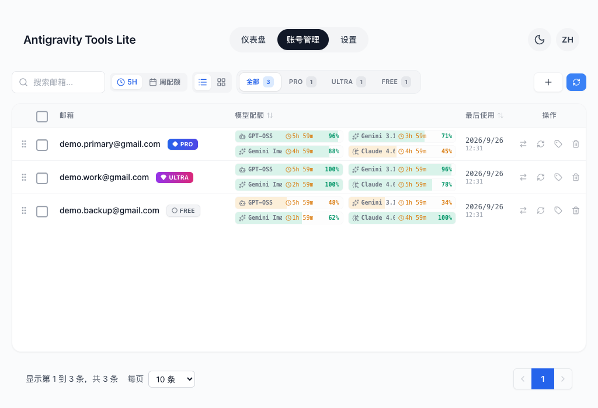
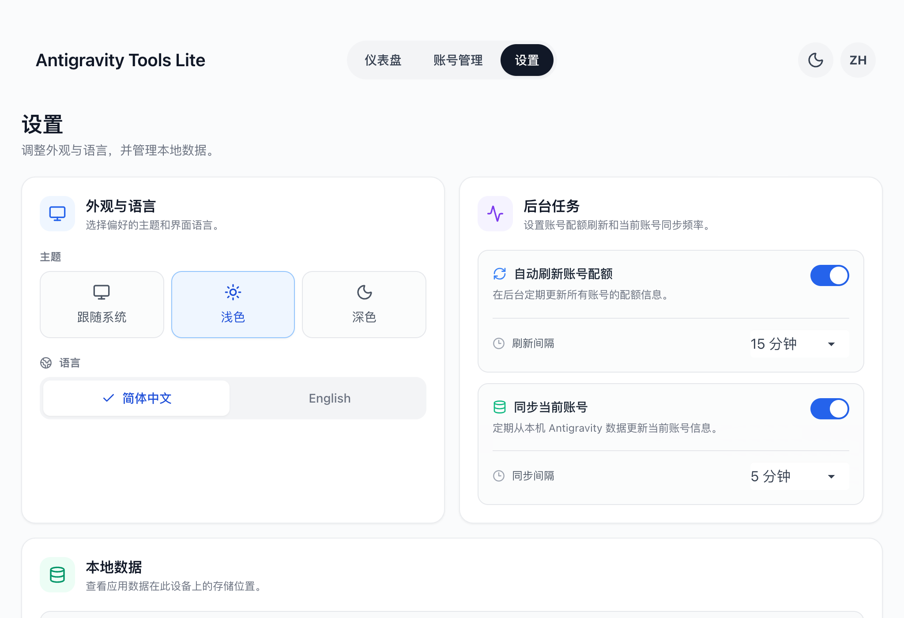

# Antigravity Tools Lite

[English](./README_EN.md)

面向 Antigravity 用户的 macOS 桌面应用：管理本机 Google 账号，并在本地查看 Token 用量与费用估算。所有数据都留在你这台机器上。

## 下载安装

**[⬇︎ 下载最新版本](https://github.com/anglee0323/Antigravity-Tools-Lite/releases/latest)**（macOS · Apple Silicon）

1. 下载 `Antigravity-Tools-<版本>-macos-arm64.zip`
2. 解压后把 `Antigravity Tools Lite.app` 拖进「应用程序」
3. 首次打开若提示「Apple 无法验证」：在「应用程序」里 **右键点图标 → 打开 → 再点「打开」**；
   或执行一次 `xattr -dr com.apple.quarantine "/Applications/Antigravity Tools Lite.app"`

> 应用为本地自签名（ad-hoc），未做 Apple 公证，所以首次打开需要手动确认，属正常现象。

**系统要求**：macOS（Apple Silicon），本机已安装 Antigravity。

## 界面

| 仪表盘（浅色） | 仪表盘（深色 / 英文） |
| --- | --- |
|  |  |

| 账号管理 | 设置 |
| --- | --- |
|  |  |

> 截图使用示例数据，用于展示界面。

## 功能

- **账号管理**：添加和管理 Google 账号、查看各模型配额与重置时间，并在本机 Antigravity 环境中切换当前账号。
- **Token 仪表盘**：扫描本地 Antigravity 对话记录，按今天、昨天、近 3 天、近 7 天或近 30 天查看用量；按模型查看明细，鼠标悬浮任意柱状条可看到该时段的输入 / 输出 / 缓存 / 请求数与**预估费用**。
- **个性化设置**：浅色、深色或跟随系统主题；简体中文和英文界面；配置后台配额刷新与当前账号同步频率。
- **本地数据**：账号配置保存在本机 `~/.antigravity_tools/`。Token 统计直接读取本地记录，费用估算所需的公开模型价格会同步并缓存。

## 与上游项目的差异

本项目基于 [lbjlaq/Antigravity-Manager](https://github.com/lbjlaq/Antigravity-Manager) 定制，只保留桌面端需要的部分：

- 移除了上游的代理服务后端（反向代理、HTTP API、Cloudflared 隧道、IP 管理、Token 统计等模块）与对应的界面入口。
- 移除了 Web/Docker 模式的登录拦截层与相关文案。
- 界面改为聚焦「账号管理 + 本地 Token 仪表盘 + 设置」，并补充了浅色/深色适配、中英双语与费用估算。

## 构建

需要 Node.js 20+、Rust stable，以及 Tauri 2 对应的 macOS 构建工具。

```bash
npm ci
npm run tauri dev       # 开发模式
npm run build           # 仅构建前端
npm run tauri build     # 构建 macOS 应用
```

应用包位于 `src-tauri/target/release/bundle/macos/`。

## 项目结构

```text
src/                  React + TypeScript 界面
src/locales/          简体中文与英文
src-tauri/src/        Rust / Tauri 桌面端
src-tauri/icons/      应用图标
docs/screenshots/     README 截图
```

## 许可与来源

本项目基于 [lbjlaq/Antigravity-Manager](https://github.com/lbjlaq/Antigravity-Manager) 定制，并沿用仓库中的 [CC BY-NC-SA 4.0](./LICENSE) 许可证。使用、修改和再分发时请遵守许可证及原项目的署名要求。
