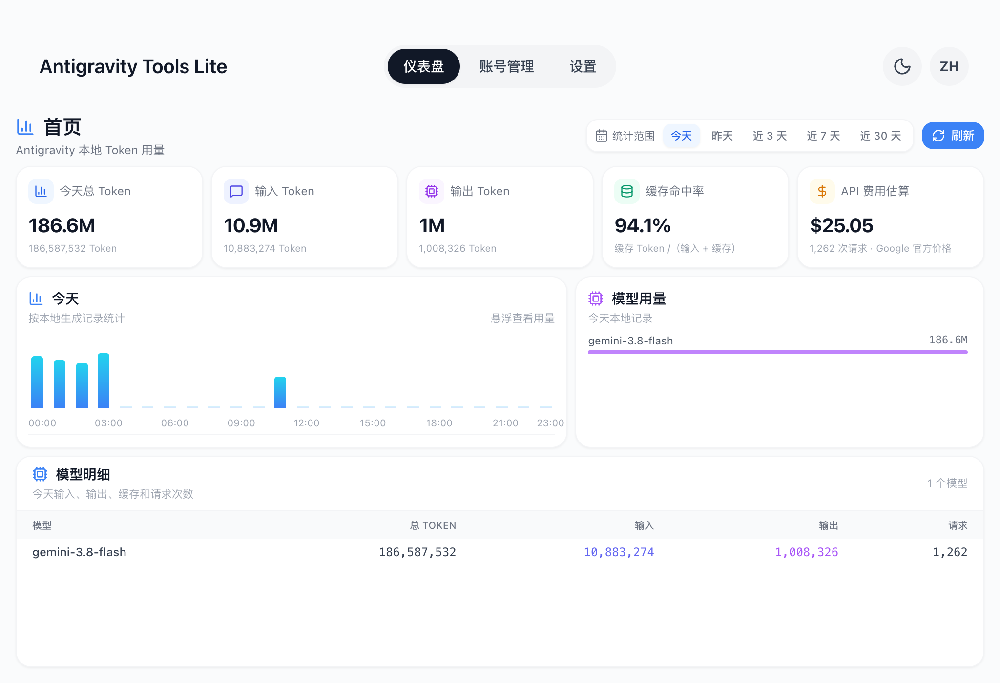
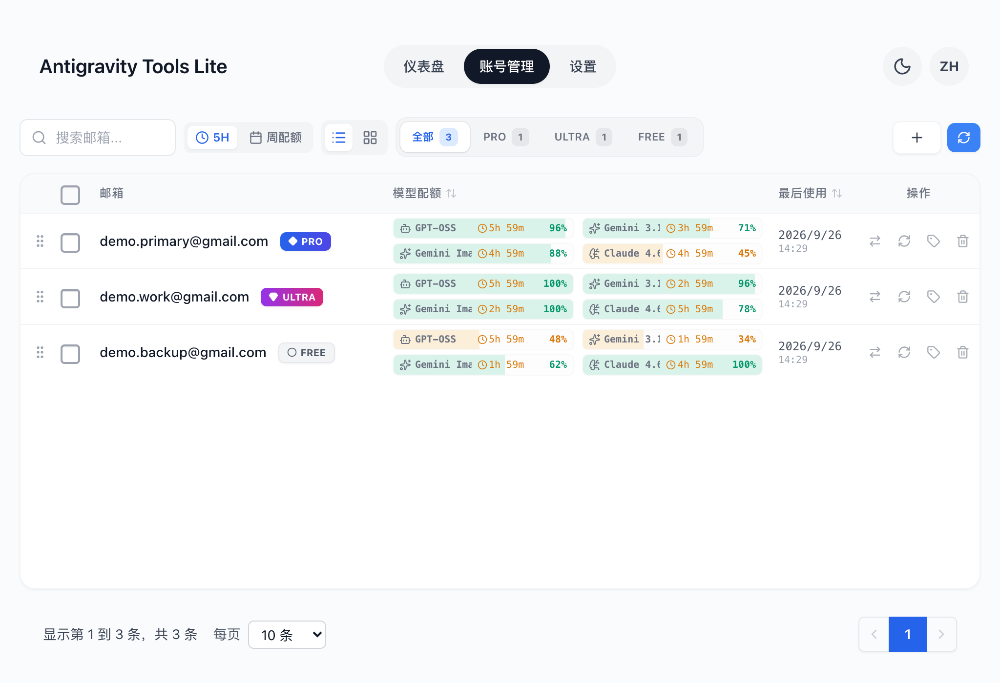
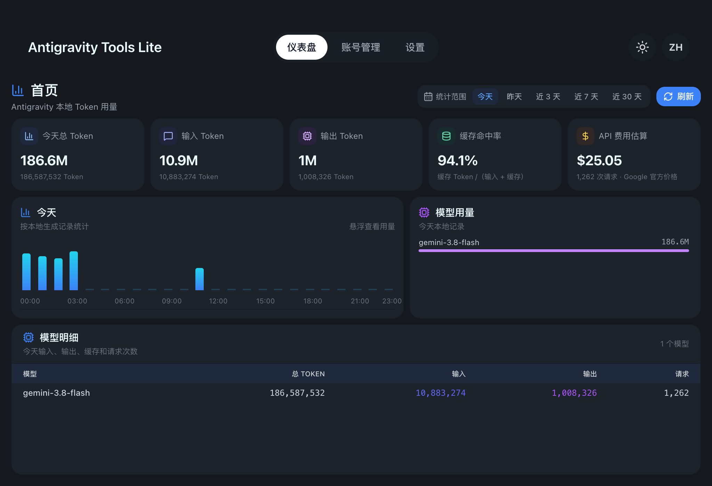

# Antigravity Tools Lite

[English](./README.md)

面向 [Antigravity](https://antigravity.google) 的本地桌面应用。用于管理 Antigravity 应用与其 `agy` CLI 所使用的 Google 账号，查看各模型配额与重置倒计时，并基于本机记录统计 Token 用量与预估 API 费用。全部处理都在本机完成



## 功能概览

- **账号管理** —— 导入本机已有账号、切换 Antigravity 使用的账号、为账号添加备注、删除账号
- **配额总览** —— 按模型查看配额与重置时间，并按 PRO / ULTRA / FREE 分组，支持表格与卡片两种视图
- **用量仪表盘** —— 今天、昨天、近 3 天、近 7 天或近 30 天的 Token 用量，按模型拆分，并给出预估 API 费用
- **一个动作覆盖两个客户端** —— Antigravity 应用与 `agy` CLI 读取同一个凭据项，切换一次即可同时生效
- **仅使用本地数据** —— 没有代理、没有后台服务、没有埋点；凭据只保存在操作系统凭据存储中
- **中英双语界面** —— 简体中文与英文，浅色与深色主题，托盘菜单

## 下载安装

**[最新版本](https://github.com/anglee0323/antigravity-tools-lite/releases/latest)**

| 平台 | 安装包 | 安装方式 |
| --- | --- | --- |
| macOS（Apple Silicon） | `Antigravity-Tools-Lite-<版本>-macos-arm64.zip` | 解压后把 `Antigravity Tools Lite.app` 移入「应用程序」 |
| Windows（x64） | `Antigravity-Tools-Lite-<版本>-windows-x64-setup.exe` | NSIS 安装程序，按用户安装 |

两个平台均为未签名构建，首次启动会出现系统提示

```bash
# macOS：在「应用程序」中右键点图标 → 打开 → 再点「打开」，或执行
xattr -dr com.apple.quarantine "/Applications/Antigravity Tools Lite.app"
```

Windows 上 SmartScreen 可能提示「Windows 已保护你的电脑」，选择 **更多信息 → 仍要运行**

## 账号管理

点击 **+** 按钮添加账号，提供三种方式

- **OAuth 授权** —— 打开浏览器完成 Google 授权后即可添加
- **Refresh Token** —— 可粘贴单个 Token，也可粘贴 JSON 数组一次导入多个账号
- **从本机导入** —— 扫描系统凭据存储、Antigravity 数据库、已安装插件以及 CLI 数据目录（`~/.antigravity-agent`），导入找到的全部账号



每一行提供四个操作，均带悬浮说明

| 操作 | 效果 |
| --- | --- |
| **切换到此账号** | 使 Antigravity 使用该账号：先关闭正在运行的 Antigravity，再把凭据写入它读取的凭据存储（2.0 以前的老版本写入 `state.vscdb`），并更新托盘。重新打开 Antigravity 即为该账号。`agy` CLI 读取同一个凭据项，因此下一条 CLI 命令同样使用该账号 |
| **刷新此账号配额** | 重新读取该账号各模型的配额与重置时间 |
| **编辑备注** | 保存最多 15 个字符的短标签，用于区分账号 |
| **删除此账号** | 从本应用中移除该账号 |

列表支持按配额重置时间或最后使用时间排序、拖拽调整顺序、在表格与卡片视图之间切换。勾选多行可批量刷新或批量删除，筛选行可将列表收窄为全部、PRO、ULTRA 或 FREE

### 切换时为何会关闭应用

Antigravity 应用与 `agy` CLI 读取同一个凭据项，切换一次对两者都生效。切换过程中关闭应用是必要的：正在运行的实例会在内存中保留旧 Token，并在刷新时写回凭据，使切换结果被静默覆盖。CLI 无需重启

对于 2.0 以前的 Antigravity 版本，没有凭据项可写，应用会自动改为把 Token 注入该版本本地的 `state.vscdb` 数据库

## 用量仪表盘

仪表盘读取 Antigravity 本地的对话数据库（`conversation.db`、`token_usage_archive.db`）及其归档目录，并对记录进行汇总。数据不会离开本机，除记录本身包含的信息外不做额外推算



- **统计范围** —— 今天、昨天、近 3 天、近 7 天或近 30 天；单日范围包含按小时的柱状图
- **图表详情** —— 指向柱状条即显示该时段的输入、输出、缓存 Token 数、请求次数与预估费用
- **汇总卡片** —— 总 Token、输入 Token、输出 Token、缓存命中率与预估 API 费用
- **模型用量与模型明细** —— 显示哪些模型在消耗配额，并提供按模型的明细表

费用依据 Google 公开的 Gemini 价格页估算，每天同步一次并缓存，同时内置兜底价格表。缺少价格的模型会标记为未计价，而不是按 0 计算

## 设置


- **外观与语言** —— 跟随系统，或选择浅色与深色；简体中文或英文
- **后台任务** —— 账号配额的自动刷新频率，以及从本地 Antigravity 数据重新读取当前账号的频率
- **本地数据** —— 应用数据位置（`~/.antigravity_tools/`），并提供打开目录的按钮

## 数据处理

| | |
| --- | --- |
| 读取 | Antigravity 本地的对话数据库与归档，其中包含 Token 数、模型名称与时间戳 |
| 写入 | `~/.antigravity_tools/` 用于保存账号、配置与价格缓存；切换账号时写入操作系统凭据存储 |
| 不上传 | 对话内容与凭据均不会上传；没有代理，也没有任何服务端组件 |

## 从源码构建

需要 Node.js 20 及以上版本、stable Rust 工具链，以及 Tauri 2 对应的平台构建工具

```bash
npm ci
npm run tauri dev       # 开发模式
npm run build           # 仅构建前端
npm run tauri build     # macOS .app 或 Windows 安装包
```

构建产物位于 `src-tauri/target/release/bundle/`。推送 `v*` tag 会触发发布工作流，同时构建两个平台并挂载到 GitHub Release

## 与上游项目的关系

本项目是 [lbjlaq/Antigravity-Manager](https://github.com/lbjlaq/Antigravity-Manager) 的精简分支。上游提供完整工具箱，包含反向代理、HTTP API、Cloudflared 隧道、IP 管理与 Docker 镜像。本分支保留账号管理与本地用量仪表盘，移除代码库中的代理与 Web 模式部分，并加入自己的仪表盘、双语界面、主题支持与发布流程。两者为独立项目，若需要代理功能请使用上游

## 许可

基于 [lbjlaq/Antigravity-Manager](https://github.com/lbjlaq/Antigravity-Manager) 定制，沿用 [CC BY-NC-SA 4.0](./LICENSE) 许可证。任何使用、修改或再分发行为均需遵守该许可证及原项目的署名要求
